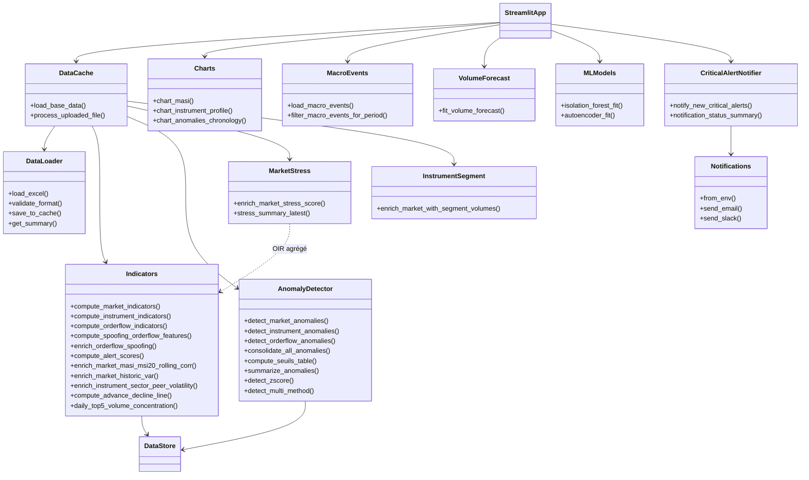
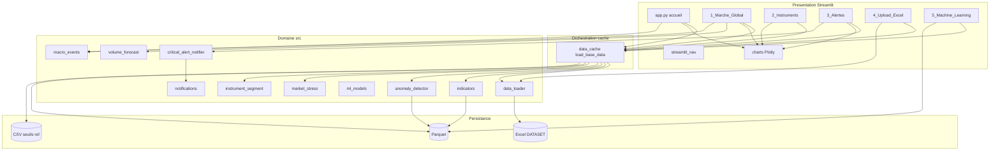
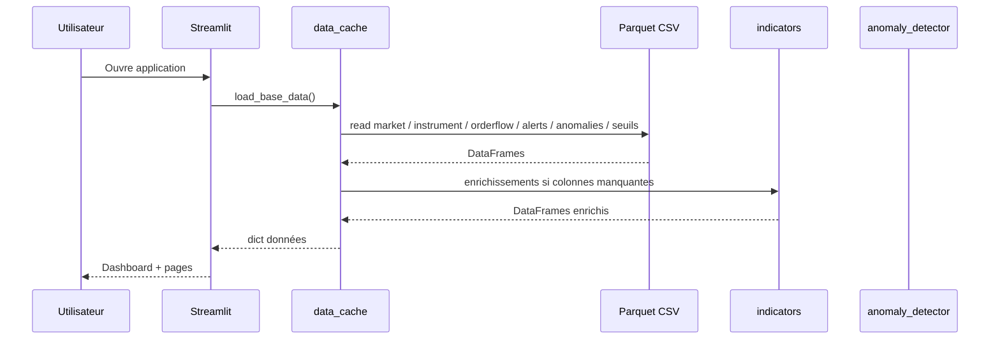
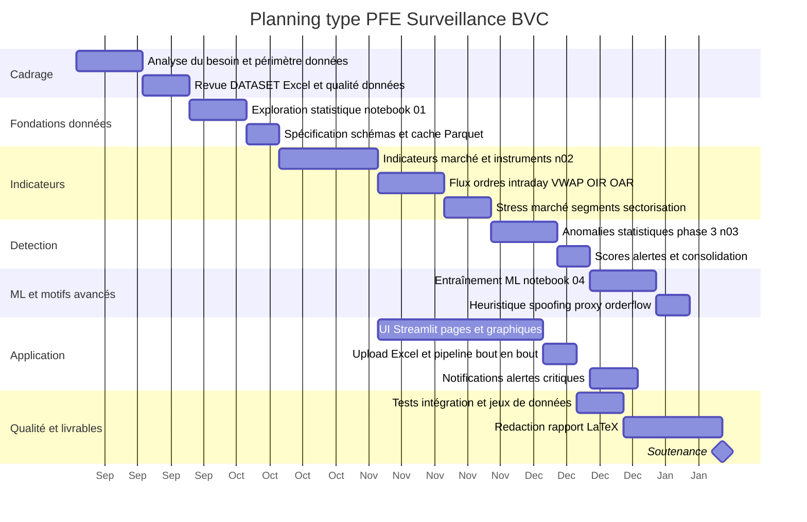

# Diagrammes — Surveillance intelligente BVC (PFE)

Ce document regroupe **quatre vues** du projet : classes (UML simplifié), cas d’utilisation, architecture et planning Gantt.  
Les blocs sont au format **[Mermaid](https://mermaid.js.org/)** : rendu natif dans GitHub, GitLab, Cursor, Obsidian ; export possible via [Mermaid Live Editor](https://mermaid.live) (PNG/SVG).

---

## 1. Diagramme de classes (UML)

Vue **logique** des principaux modules Python et de leurs relations (agrégation / dépendance). Les « classes » correspondent aux **fichiers / responsabilités** du dépôt, pas à chaque fonction.

---

## 2. Diagramme de cas d’utilisation (Use Case)

**Acteurs** : analyste / décideur marché, gestionnaire de risques, administrateur technique (optionnel).

```mermaid
flowchart TB
    subgraph ACT["Acteurs"]
        A1[Analyste marche]
        A2[Analyste instrument risque]
        A3[Responsable technique donnees]
    end

    subgraph SYST["Systeme Surveillance BVC"]
        UC1["UC1: Vue ensemble marche"]
        UC2["UC2: Stress marche et qualite"]
        UC3["UC3: Graphiques MASI volume macro"]
        UC4["UC4: Profil instrument liquidite"]
        UC5["UC5: Flux ordres OIR OAR VWAP"]
        UC6["UC6: Proxy motifs spoofing"]
        UC7["UC7: Anomalies statistiques"]
        UC8["UC8: Scores alerte"]
        UC9["UC9: Notifications critiques"]
        UC10["UC10: Anomalies ML"]
        UC11["UC11: Upload Excel pipeline"]
        UC12["UC12: Export donnees seuils"]
        UC13["UC13: Prevision volume marche"]
    end

    A1 --> UC1
    A1 --> UC2
    A1 --> UC3
    A1 --> UC7
    A1 --> UC8
    A1 --> UC10

    A2 --> UC4
    A2 --> UC5
    A2 --> UC6
    A2 --> UC7
    A2 --> UC8

    A3 --> UC11
    A3 --> UC12
    A1 --> UC9
    A2 --> UC9

    A1 --> UC13
```

**Tableau de traçabilité (résumé)**

| UC   | Description courte                         | Pages / modules principaux      |
|------|---------------------------------------------|-----------------------------------|
| UC1–3 | Tableau de bord, stress, MASI, macro       | `app.py`, `1_Marche_Global.py`, `charts.py`, `market_stress.py`, `macro_events.py` |
| UC4–6 | Instrument, orderflow, spoofing            | `2_Instruments.py`, `indicators.py` |
| UC7–9 | Anomalies, alertes, notifications          | `3_Alertes.py`, `anomaly_detector.py`, `critical_alert_notifier.py`, `notifications.py` |
| UC10 | ML                                         | `5_Machine_Learning.py`, `ml_models.py`, notebooks `04_*` |
| UC11 | Upload                                     | `4_Upload_Excel.py`, `data_cache.process_uploaded_file` |
| UC12 | Données / seuils                           | Parquets, `seuils_phase3.csv`, exports notebook |
| UC13 | Prévision volume                           | `1_Marche_Global.py`, `volume_forecast.py` |

---

## 3. Diagramme d’architecture

Vue **multicouche** : présentation, orchestration cache, domaine métier, persistance.

**Flux principal (données figées)**

---

## 4. Diagramme de Gantt (planning type PFE)

Planning **indicatif** sur ~5 mois (à adapter aux dates réelles de ton stage). Les phases reflètent les notebooks et livrables du dépôt.

Pour coller à ton calendrier réel, modifie les dates (`2025-09-01`, durées `14d`, etc.) directement dans le bloc `gantt` ci-dessus.

---

## Utilisation rapide

1. **Prévisualisation** : ouvre ce fichier dans un éditeur compatible Mermaid (Cursor, VS Code + extension Mermaid).
2. **Export image** : copie un bloc dans [mermaid.live](https://mermaid.live) → Export PNG/SVG.
3. **LaTeX** : importe les SVG générés dans `rapport/` avec `\includegraphics`.

---

*Document généré pour le projet BourseDeCasablancaPFE — cohérent avec la structure du dépôt au moment de la rédaction.*
